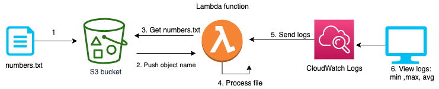

- Run a Lambda function when objects are uploaded into an S3 bucket: 

**Steps**:
1. Create a s3 bucket and upload the `numbers.txt` file to the bucket
2. Create an execution role for the Lambda function with basic execution roles to CloudWatch logs and read only access for S3 bucket:
`AmazonS3ReadOnlyAccess`
`AWSLambdaBasicExecutionRole`
3. Create Lambda function
